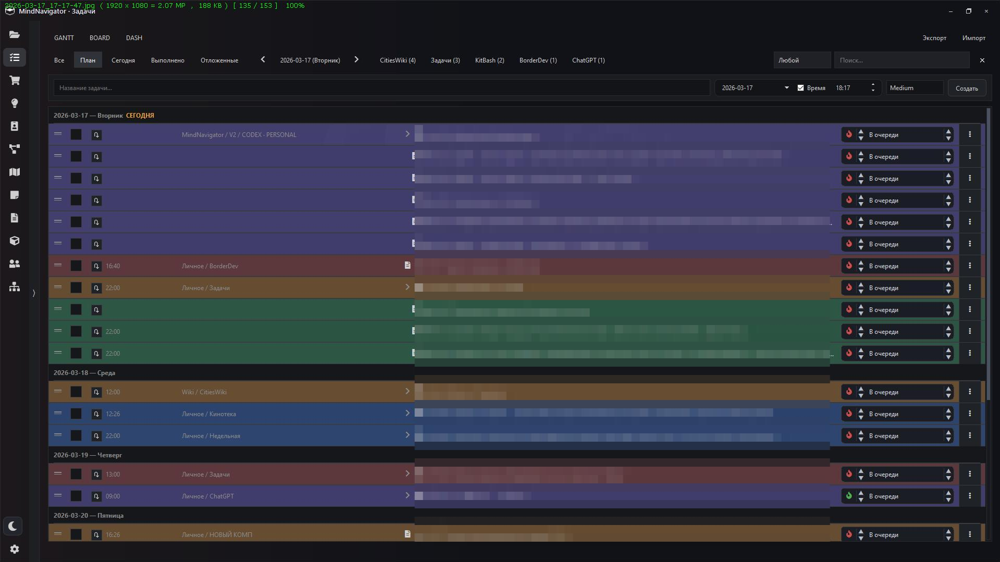
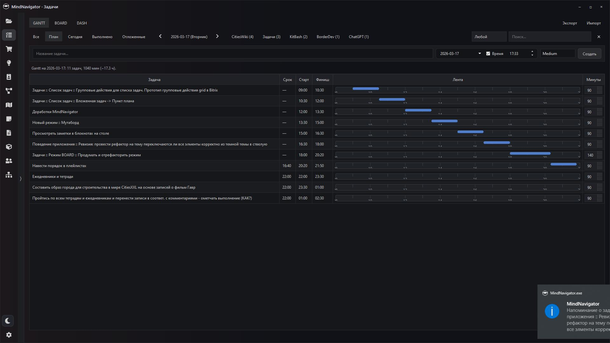
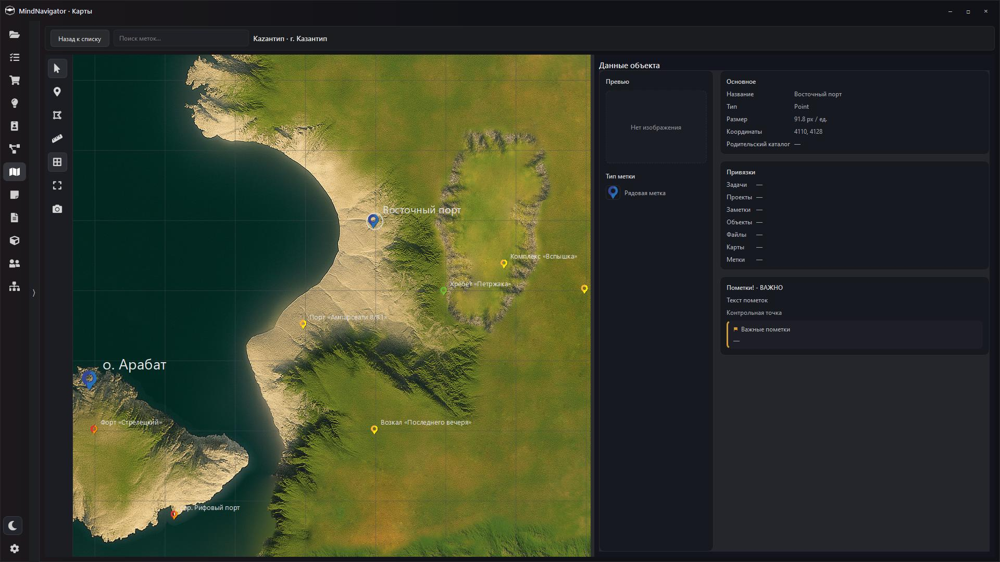
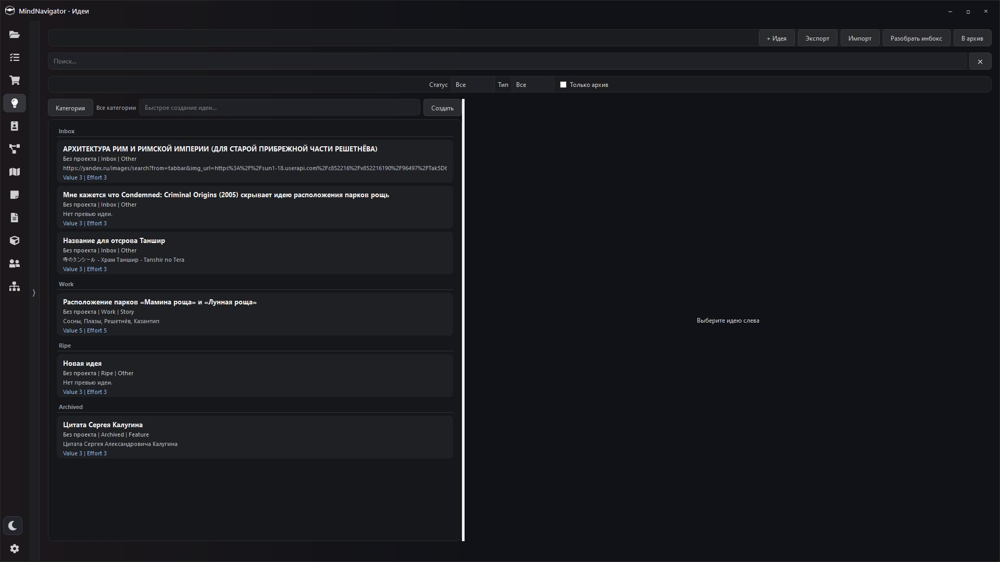
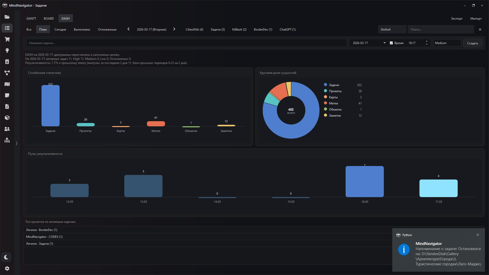

# MindNavigator v2 (build: 13.05.2026)

[](https://www.python.org/)
[](https://doc.qt.io/qtforpython/)
[](#локальная-база-данных)

**MindNavigator** - настольный центр управления задачами, проектами, картами, заметками, файлами, объектами, идеями и покупками в одном интерфейсе. Приложение использует локальную SQLite-базу, кастомный заголовок окна, левый rail режимов и быстрый поиск по сущностям.

## Preview

<table>
  <tr>
    <td align="center" width="50%">
      <a href="preview/task.jpg">
        
      </a>
      <br>
      <sub><b>Задачи</b> — список задач, цветовые маркеры и быстрые действия.</sub>
    </td>
    <td align="center" width="50%">
      <a href="preview/gant.jpg">
        
      </a>
      <br>
      <sub><b>GANTT</b> — почасовая раскладка и лента выполнения на день.</sub>
    </td>
  </tr>
  <tr>
    <td align="center" width="50%">
      <a href="preview/maps.jpg">
        
      </a>
      <br>
      <sub><b>Карты</b> — карта, метки и карточка выбранного объекта.</sub>
    </td>
    <td align="center" width="50%">
      <a href="preview/ideas.jpg">
        
      </a>
      <br>
      <sub><b>Идеи</b> — inbox, категории, фильтры и быстрый разбор.</sub>
    </td>
  </tr>
  <tr>
    <td align="center" width="50%">
      <a href="preview/statistiks.jpg">
        
      </a>
      <br>
      <sub><b>DASH</b> — результативность, структура данных и обзор активности.</sub>
    </td>
    <td align="center" width="50%">
      <a href="preview/task.jpg">
        
      </a>
      <br>
      <sub><b>Общий вид</b> — тёмный desktop UI с единым левым rail и режимами работы.</sub>
    </td>
  </tr>
</table>


## Ключевые возможности

- **Frameless UI**: собственный `TitleBar`, ресайз по краям, snap, `F11` для полноэкранного режима.
- **Tray-режим**: сворачивание в трей и быстрое восстановление окна.
- **Single instance**: второе окно не запускается, а отправляет сообщение на восстановление текущего.
- **Быстрый поиск** по задачам, проектам, картам и меткам, заметкам, файлам, объектам.
- **Единая база данных**: SQLite (WAL), авто-инициализация схемы, легкие миграции, демо-данные при пустой базе.

## Рабочие пространства

### Задачи
- Быстрое создание (дата, время, приоритет).
- Вкладки и фильтры по статусу и срокам.
- Привязки: заметки, объекты, карты, метки, файлы.

### Проекты
- Список проектов с area, статусом и приоритетами.
- Фильтрация задач по проекту через навигацию.

### Покупки
- Таблица товаров, карточка товара, источники (URL), история цен.
- Парсинг карточек товаров через адаптеры интернет-магазинов.
- Сравнение товаров по нормализованным свойствам.

### Идеи
- Дерево категорий и карточки идей.
- Поиск, фильтрация и быстрые операции из списка.

### Коллекции
- Дерево категорий коллекций.
- Импорт коллекций из папки и синхронизация.
- Превью изображений, видео и документов.

### Карты
- Создание карт с тайлами (W/H) и каталогом тайлов.
- Просмотр и редактирование карт с метками.
- Правая панель данных объекта с изменяемой шириной.

### Заметки
- Теги, привязки к проектам, избранное и блокировка.

### Файлы
- Работа с "облачной" папкой на диске.
- Индексация файлов, метаданные и предпросмотр.

### Объекты
- Каталог объектов (title, catalog, type, status, description).
- Привязки к задачам и меткам.
- Извлечение текста из документов (`.txt`, `.docx`, `.doc`).

### Персонажи
- Отдельное пространство для карточек персонажей и их связей.

### MindDraw
- Пространство для визуального планирования и скетчинга идей.

### Настройки
- Переключение ключевых runtime-настроек без перезапуска, где это возможно.

## Локальная база данных

- SQLite-файл создается автоматически.
- Путь по умолчанию: `~/.mindnavigator/mindnavigator.db`
- Включены `WAL`, `foreign_keys=ON`, индексы по ключевым полям.
- При пустой базе добавляются демо-данные.

## Установка и запуск

### Требования

- Python 3.11+
- PySide6
- qtawesome

### Установка зависимостей

```bash
pip install -r requirements.txt
```

### Запуск

```bash
python main.py
```

Или пакетным entrypoint:

```bash
python -m mindnavigator
```

## Проверки для разработки

```bash
python -m compileall mindnavigator main.py
```

```bash
PYTHONPATH=. pytest tests -p no:cacheprovider --basetemp .pytest_dir/run_tmp
```

## Сборка Windows (PyInstaller)

Готовый spec-файл: `pyinstaller.spec`

```bash
pyinstaller pyinstaller.spec
```

- Иконка: `assets/icon.ico`
- В сборку включается каталог `assets/`

## Структура проекта

- `main.py` - совместимый корневой entrypoint.
- `mindnavigator/__main__.py` - пакетная точка входа (`python -m mindnavigator`).
- `mindnavigator/main_window.py` - каркас приложения, режимы, трей, хоткеи.
- `mindnavigator/storage.py` - SQLite-хранилище, dataclass-сущности, миграции.
- `mindnavigator/ui/` - общие виджеты (`TitleBar`, rail, поиск).
- `mindnavigator/ui/dialogs/` - диалоги и формы.
- `mindnavigator/workspaces/` - рабочие пространства приложения.
- `tests/` - тесты.
- `assets/` - ресурсы приложения.

## Полезно для разработки

- Сброс демо-данных: удалить `~/.mindnavigator/mindnavigator.db`.
- Глобальные стили: `mindnavigator/ui/styles.py`.

## Roadmap

- Синхронизация с FastAPI + S3.
- Улучшения MapEditor: тайлы, слои, массовые операции.
- Единая система вложений и предпросмотра для всех сущностей.

## Лицензия

Пока не определена.
