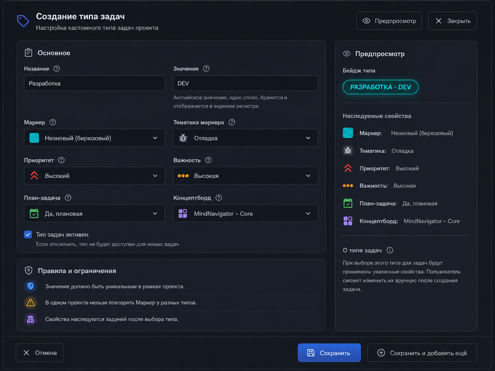
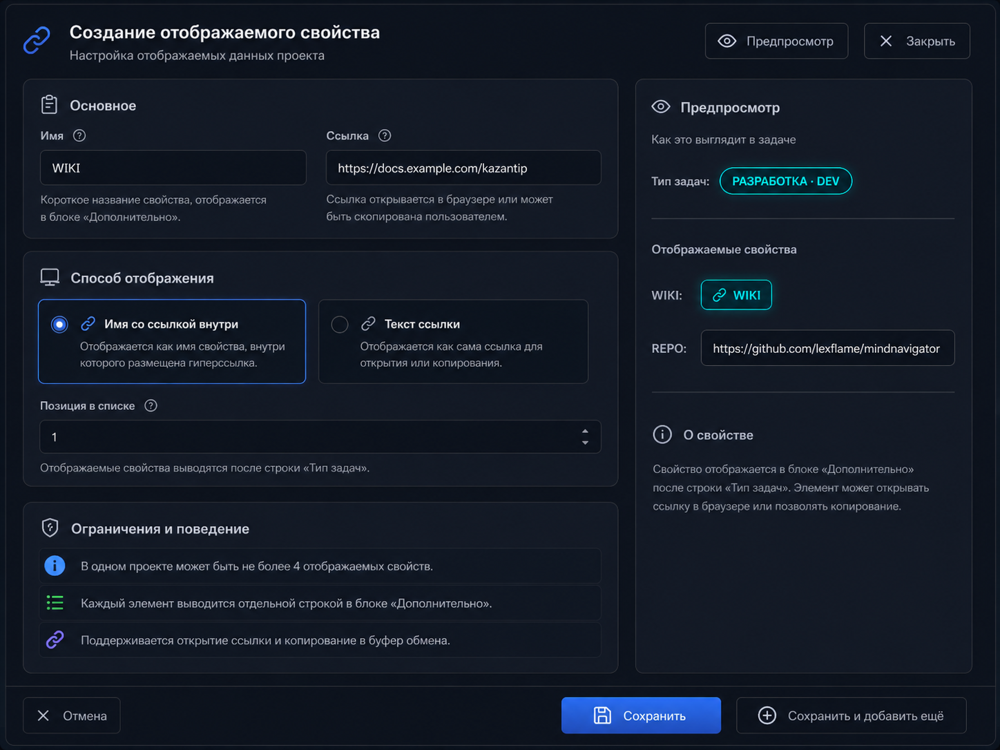

# ТЗ для CODEX CLI: кастомные типы задач проекта и отображаемые проектные данные

## Контекст

Разрабатывается desktop-приложение на Python с Qt-интерфейсом.

Необходимо доработать режим `Проекты`, форму создания/редактирования проекта и интеграцию проектных свойств с режимом `Задачи`.

В рамках задачи нужно реализовать два связанных блока функциональности:

1. `Кастомные типы задач`.
2. `Отображаемые свойства`.

Оба блока настраиваются внутри формы создания/редактирования проекта и должны иметь отражение в задачах проекта, в том числе в блоке `Дополнительно` из ветки `feat/remaster-task-window`.

## Цель

Добавить в проект кастомизируемые пользовательские свойства, которые позволяют:

- создавать справочник типов задач внутри конкретного проекта;
- задавать для типа задач набор наследуемых свойств из режима `Задачи`;
- применять эти свойства к задаче при выборе типа задачи;
- отображать выбранный тип задачи в блоке `Дополнительно`;
- добавлять до 4 отображаемых проектных свойств со ссылками;
- выводить отображаемые проектные свойства в задачах проекта отдельными строками после строки `Тип задач`.

## Область изменений

- Workspace `Проекты`.
- Форма создания проекта.
- Форма редактирования проекта.
- Workspace `Задачи`.
- Форма создания задачи.
- Форма редактирования задачи.
- Блок `Дополнительно` в форме задачи из ветки `feat/remaster-task-window`.
- Модель проекта.
- Модель задачи.
- Storage-слой проектов.
- Storage-слой задач, если требуется добавление поля выбранного типа.
- Справочники значений режима `Задачи`.
- UI-компоненты выбора маркера, тематики, приоритета, важности, план-задачи, концептборда.
- Delegate или renderer списка задач, если вид задачи зависит от типа.
- Механизм сохранения и восстановления данных.
- Импорт/экспорт проектов, если он затрагивает проектные данные.

## Рабочая ветка и файловая структура задачи

Для выполнения задачи CODEX CLI должен создать и использовать ветку:

`feat/custom_type_for_project`

Рекомендуемая файловая структура материалов задачи:

- `custom_type_for_project/TZ_projects_custom_task_types_display_data.md` - основное ТЗ;
- `custom_type_for_project/windows_type_task_edit.png` - прототип формы создания/редактирования `Тип задач`;
- `custom_type_for_project/windows_display_data_task_edit.png` - прототип формы создания/редактирования `Отображаемые свойства`.

## Прототипы интерфейса

В рамках реализации необходимо ориентироваться на приложенные прототипы. Они фиксируют визуальную композицию, цветовую схему, расположение блоков, настроение интерфейса и набор элементов управления.

### Прототип формы создания/редактирования `Тип задач`

Файл прототипа:

`custom_type_for_project/windows_type_task_edit.png`

### Прототип формы создания/редактирования `Отображаемые свойства`

Файл прототипа:

`custom_type_for_project/windows_display_data_task_edit.png`

## Общие требования к визуальному стилю по прототипам

Интерфейс новых форм должен быть приведен к цветовой схеме и дизайну текущего окна просмотра проекта. Основной визуальный язык: темная панельная тема, мягкие контуры, сине-графитовые поверхности, аккуратные разделители, приглушенный текст и яркие функциональные акценты.

Общие требования:

- использовать темную цветовую схему проекта;
- использовать карточную компоновку блоков;
- использовать скругленные панели и поля ввода;
- использовать тонкие обводки и деликатные разделители;
- использовать акцентный синий для primary-действий;
- использовать неоновый бирюзовый для preview-бейджей и ссылочных элементов;
- избегать светлой Bootstrap-темы в реальном UI;
- Bootstrap 4 использовать как композиционный референс: карточки, бейджи, compact forms, input group, button group;
- UI должен выглядеть как часть существующего desktop-приложения, а не как веб-форма, вставленная без адаптации;
- все иконки брать из доступного набора `qt-awesome`;
- не добавлять новые зависимости ради иконок;
- если иконка недоступна, подобрать ближайший аналог из `qt-awesome`.

## Рекомендуемые qt-awesome иконки

Для формы `Тип задач` использовать следующие иконки или ближайшие доступные аналоги:

- заголовок формы: `fa6s.tag` или `fa6s.tags`;
- кнопка предпросмотра: `fa6s.eye`;
- закрыть: `fa6s.xmark`;
- раздел `Основное`: `fa6s.clipboard-list`;
- help tooltip: `fa6s.circle-question`;
- маркер: `fa6s.square`;
- тематика маркера: `fa6s.bug` или существующая иконка тематического маркера;
- приоритет: `fa6s.angles-up`;
- важность: `fa6s.ellipsis`;
- план-задача: `fa6s.calendar-check`;
- концептборд: `fa6s.table-cells-large`;
- правила и ограничения: `fa6s.shield-halved`;
- информационное правило: `fa6s.circle-info`;
- предупреждение: `fa6s.triangle-exclamation`;
- сохранить: `fa6s.floppy-disk`;
- сохранить и добавить еще: `fa6s.circle-plus`;
- отмена: `fa6s.xmark`.

Для формы `Отображаемые свойства` использовать следующие иконки или ближайшие доступные аналоги:

- заголовок формы: `fa6s.link`;
- раздел `Основное`: `fa6s.clipboard-list`;
- раздел `Способ отображения`: `fa6s.display`;
- режим `Имя со ссылкой внутри`: `fa6s.link`;
- режим `Текст ссылки`: `fa6s.link`;
- позиция в списке: `fa6s.arrow-down-1-9` или стандартный spinbox без отдельной иконки;
- ограничения и поведение: `fa6s.shield-halved`;
- список: `fa6s.list`;
- предпросмотр: `fa6s.eye`;
- информация: `fa6s.circle-info`;
- сохранить: `fa6s.floppy-disk`;
- сохранить и добавить еще: `fa6s.circle-plus`;
- закрыть: `fa6s.xmark`;
- отмена: `fa6s.xmark`.

## UI-спецификация формы `Создание/редактирование типа задач`

Форма должна быть реализована как модальное или встроенное окно, визуально соответствующее прототипу `windows_type_task_edit.png`.

### Заголовочная область

В верхней части формы расположить:

- крупную иконку типа задачи слева;
- заголовок `Создание типа задач` для режима создания;
- заголовок `Редактирование типа задач` для режима редактирования;
- подзаголовок `Настройка кастомного типа задач проекта`;
- справа кнопки `Предпросмотр` и `Закрыть`.

Кнопка `Предпросмотр` должна включать или фокусировать правую preview-панель. Если preview всегда отображается, кнопка может выполнять прокрутку/фокус к панели предпросмотра или обновлять preview вручную.

### Основная компоновка

Форма делится на две колонки:

- левая широкая колонка - редактируемые поля;
- правая узкая колонка - `Предпросмотр`.

Внизу формы закрепить footer с действиями:

- `Отмена`;
- `Сохранить`;
- `Сохранить и добавить ещё`.

Primary-кнопка `Сохранить` должна быть выделена синим акцентом.

### Блок `Основное`

В блоке `Основное` разместить поля:

- `Название`;
- `Значение`;
- `Маркер`;
- `Тематика маркера`;
- `Приоритет`;
- `Важность`;
- `План-задача`;
- `Концептборд`;
- чекбокс `Тип задач активен`.

Поля `Название` и `Значение` расположить в первой строке в две колонки.

Поля наследуемых свойств расположить сеткой 2 колонки x 3 строки:

- `Маркер` + `Тематика маркера`;
- `Приоритет` + `Важность`;
- `План-задача` + `Концептборд`.

У каждого поля должен быть маленький help-icon рядом с label, если это не перегружает UI. Tooltip должен кратко объяснять назначение поля.

### Поле `Название`

В прототипе пример значения: `Разработка`.

Требования:

- обычное текстовое поле;
- обязательно к заполнению;
- отображается пользователю;
- участвует в тексте preview-бейджа;
- не приводится к верхнему регистру автоматически.

### Поле `Значение`

В прототипе пример значения: `DEV`.

Требования:

- текстовое поле;
- ввод на английском языке;
- одно слово;
- хранится и отображается в верхнем регистре;
- при вводе можно автоматически приводить к верхнему регистру;
- под полем показать пояснение: `Английское значение, одно слово. Хранится и отображается в верхнем регистре.`

### Поля выбора наследуемых свойств

Поля `Маркер`, `Тематика маркера`, `Приоритет`, `Важность`, `План-задача`, `Концептборд` должны быть combobox/input-group компонентами в стиле текущей темной темы.

Каждый combobox должен содержать:

- иконку или цветовой индикатор слева;
- текущее выбранное значение;
- стрелку раскрытия справа;
- значения из соответствующих справочников режима `Задачи`.

Примеры из прототипа:

- `Маркер`: `Неоновый (бирюзовый)`;
- `Тематика маркера`: `Отладка`;
- `Приоритет`: `Высокий`;
- `Важность`: `Высокая`;
- `План-задача`: `Да, плановая`;
- `Концептборд`: `MindNavigator – Core`.

### Чекбокс активности

Внизу блока `Основное` разместить чекбокс:

`Тип задач активен`

Подсказка под чекбоксом:

`Если отключить, тип не будет доступен для новых задач.`

Если в рамках текущей задачи деактивация уже связана с поведением задач, необходимо использовать существующее правило деактивации. Если такая логика еще не реализована, минимум - скрыть неактивный тип из выбора для новых задач.

### Блок `Правила и ограничения`

Под блоком `Основное` разместить блок `Правила и ограничения`.

В нем вывести 3 строки-подсказки с иконками:

- `Значение должно быть уникальным в рамках проекта.`
- `В одном проекте нельзя повторять Маркер у разных типов.`
- `Свойства наследуются задачей после выбора типа.`

Блок является информационным, но должен использовать реальные правила валидации формы.

### Правая панель `Предпросмотр`

Правая панель должна показывать live-preview выбранного типа.

Состав панели:

- заголовок `Предпросмотр`;
- подпись `Бейдж типа`;
- бейдж вида `РАЗРАБОТКА · DEV`;
- разделитель;
- блок `Наследуемые свойства`;
- список наследуемых свойств с иконками;
- разделитель;
- блок `О типе задач`;
- информационный текст.

Бейдж должен:

- быть оформлен как Bootstrap 4 badge, адаптированный под темную тему;
- использовать цвет из выбранного `Маркер`;
- использовать неоновый/акцентный контур, если это соответствует маркеру;
- показывать `Название` и `Значение`;
- отображать `Значение` в верхнем регистре.

Пример бейджа:

`РАЗРАБОТКА · DEV`

Блок наследуемых свойств должен повторять текущие выбранные значения формы и обновляться при изменении полей.

### Footer формы `Тип задач`

В нижней панели формы расположить:

- слева `Отмена`;
- справа `Сохранить`;
- справа `Сохранить и добавить ещё`.

Поведение:

- `Отмена` закрывает форму без сохранения;
- `Сохранить` валидирует и сохраняет тип;
- `Сохранить и добавить ещё` сохраняет тип, очищает форму и оставляет окно открытым для создания следующего типа.

## UI-спецификация формы `Создание/редактирование отображаемого свойства`

Форма должна быть реализована как модальное или встроенное окно, визуально соответствующее прототипу `windows_display_data_task_edit.png`.

### Заголовочная область

В верхней части формы расположить:

- крупную иконку ссылки слева;
- заголовок `Создание отображаемого свойства` для режима создания;
- заголовок `Редактирование отображаемого свойства` для режима редактирования;
- подзаголовок `Настройка отображаемых данных проекта`;
- справа кнопки `Предпросмотр` и `Закрыть`.

### Основная компоновка

Форма делится на две колонки:

- левая широкая колонка - поля настройки;
- правая узкая колонка - `Предпросмотр`.

Внизу формы закрепить footer с действиями:

- `Отмена`;
- `Сохранить`;
- `Сохранить и добавить ещё`.

### Блок `Основное`

В блоке `Основное` разместить поля:

- `Имя`;
- `Ссылка`.

Поля расположить в две колонки.

Под полем `Имя` показать подсказку:

`Короткое название свойства, отображается в блоке «Дополнительно».`

Под полем `Ссылка` показать подсказку:

`Ссылка открывается в браузере или может быть скопирована пользователем.`

### Поле `Имя`

В прототипе пример значения: `WIKI`.

Требования:

- короткое имя свойства;
- рекомендуется отображать в верхнем регистре;
- обязательно для режима `Имя со ссылкой внутри`;
- используется как label в блоке `Дополнительно`;
- используется в preview.

### Поле `Ссылка`

В прототипе пример значения:

`https://docs.example.com/kazantip`

Требования:

- обязательно к заполнению;
- может быть URL или путь;
- не выполнять чрезмерно строгую валидацию, чтобы не заблокировать локальные пути;
- при клике из блока `Дополнительно` открывать ссылку или путь существующим механизмом приложения;
- для режима `Текст ссылки` добавить возможность копирования ссылки в буфер обмена.

### Блок `Способ отображения`

Разместить две крупные radio-card опции:

1. `Имя со ссылкой внутри`;
2. `Текст ссылки`.

Каждая опция должна быть оформлена как карточка с radio-индикатором, иконкой, заголовком и описанием.

Активная опция должна иметь синий контур и акцентную подсветку.

Описание для режима `Имя со ссылкой внутри`:

`Отображается как имя свойства, внутри которого размещена гиперссылка.`

Описание для режима `Текст ссылки`:

`Отображается как сама ссылка для открытия или копирования.`

### Поле `Позиция в списке`

Под radio-card опциями разместить поле:

`Позиция в списке`

Требования:

- числовое поле или spinbox;
- задает `sort_order`;
- минимальное значение 1;
- максимальное значение 4;
- используется для порядка отображения в блоке `Дополнительно`;
- под полем показать подсказку: `Отображаемые свойства выводятся после строки «Тип задач».`

### Блок `Ограничения и поведение`

Под блоком `Способ отображения` разместить информационный блок `Ограничения и поведение`.

В нем вывести 3 строки-подсказки с иконками:

- `В одном проекте может быть не более 4 отображаемых свойств.`
- `Каждый элемент выводится отдельной строкой в блоке «Дополнительно».`
- `Поддерживается открытие ссылки и копирование в буфер обмена.`

### Правая панель `Предпросмотр`

Правая панель должна показывать live-preview того, как данные будут выглядеть в задаче.

Состав панели:

- заголовок `Предпросмотр`;
- подпись `Как это выглядит в задаче`;
- пример строки `Тип задачи` с бейджем;
- разделитель;
- блок `Отображаемые свойства`;
- список отображаемых свойств;
- разделитель;
- блок `О свойстве`;
- информационный текст.

Preview должен показывать два режима:

- для `Имя со ссылкой внутри`: строка вида `WIKI: [WIKI]`;
- для `Текст ссылки`: строка вида `REPO: [https://github.com/lexflame/mindnavigator]`.

Бейджи должны быть оформлены как Bootstrap 4 badge, адаптированный под темную тему, с неоновым бирюзовым акцентом для ссылочных элементов.

### Footer формы `Отображаемые свойства`

В нижней панели формы расположить:

- слева `Отмена`;
- справа `Сохранить`;
- справа `Сохранить и добавить ещё`.

Поведение:

- `Отмена` закрывает форму без сохранения;
- `Сохранить` валидирует и сохраняет отображаемое свойство;
- `Сохранить и добавить ещё` сохраняет свойство, очищает форму и оставляет окно открытым для создания следующего свойства;
- если в проекте уже есть 4 отображаемых свойства, `Сохранить и добавить ещё` должен быть скрыт или заблокирован.

## Пользовательская история 1: Кастомные типы задач

### Основной сценарий

1. Пользователь переходит в режим `Проекты`.
2. Пользователь создает новый `Проект` или открывает существующий `Проект`.
3. В форме создания/редактирования проекта пользователь видит раздел `Кастомные типы задач`.
4. Пользователь добавляет новый кастомный `Тип задач`.
5. Для типа задач пользователь задает:
   - `Название`;
   - `Значение`;
   - `Маркер`;
   - `Тематика маркера`;
   - `Приоритет`;
   - `Важность`;
   - `План-задача`;
   - `Концептборд`.
6. В режиме `Задачи` пользователь открывает форму создания/редактирования задачи.
7. Если задача относится к проекту, у которого есть кастомные типы, пользователь может выбрать `Тип задачи`.
8. После выбора типа задача наследует свойства, определенные в выбранном типе.
9. Выбранный тип отражается в блоке `Дополнительно`.
10. Значения свойств типа влияют на внешний вид и поведение задачи внутри режима `Задачи`.

## Терминология

`Кастомный тип задач` - пользовательский тип задач, созданный внутри конкретного проекта.

`Название типа` - человекочитаемое русское или произвольное название типа, например `Разработка`, `Музыка`, `Аналитика`.

`Значение типа` - техническое значение на английском языке в одно слово, например `dev`, `music`, `analysis`. Хранится и отображается в верхнем регистре: `DEV`, `MUSIC`, `ANALYSIS`.

`Наследуемые свойства` - свойства режима `Задачи`, которые применяются к задаче при выборе соответствующего типа.

`Справочник в справочнике` - кастомные типы задач являются внутренним справочником конкретного проекта.

## Раздел `Кастомные типы задач`

В форме создания/редактирования проекта необходимо добавить раздел:

`Кастомные типы задач`

Раздел должен позволять пользователю:

- добавлять тип;
- редактировать тип;
- удалять тип;
- просматривать список типов;
- задавать наследуемые свойства типа;
- видеть, какие свойства будут применяться к задаче;
- сохранять любое количество типов.

Количество типов задач внутри проекта не ограничивать искусственно.

## Поля кастомного типа задач

Каждый кастомный тип задач должен содержать следующие поля:

- `id`;
- `project_id`;
- `name`;
- `value`;
- `marker`;
- `marker_theme`;
- `priority`;
- `importance`;
- `is_plan_task`;
- `concept_board`;
- `sort_order`;
- `created_at`;
- `updated_at`.

Если в проекте уже есть существующий стиль именования полей, использовать его.

## Поле `Название`

Поле `Название` предназначено для человекочитаемого названия типа.

Требования:

- обязательно к заполнению;
- может быть на русском языке;
- может содержать пробелы;
- отображается пользователю в UI;
- не обязано быть уникальным, если бизнес-логика проекта этого не требует.

Примеры:

- `Разработка`;
- `Музыка`;
- `Личное`;
- `Аналитика`;
- `Отладка`.

## Поле `Значение`

Поле `Значение` является техническим значением типа.

Требования:

- обязательно к заполнению;
- английский язык;
- одно слово;
- без пробелов;
- хранится в верхнем регистре;
- отображается в верхнем регистре;
- используется как короткое значение типа в UI;
- должно быть уникальным в рамках одного проекта.

Примеры допустимых значений после нормализации:

- `DEV`;
- `MUSIC`;
- `PERSONAL`;
- `ANALYSIS`;
- `DEBUG`.

Недопустимые примеры:

- `dev music`;
- `разработка`;
- `dev/music`;
- пустая строка.

Рекомендуемая валидация:

- разрешить латинские буквы `A-Z`;
- разрешить цифры `0-9`, если это допустимо для проекта;
- разрешить `_`, если нужно;
- запретить пробелы;
- запретить кириллицу;
- перед сохранением выполнять `strip`;
- перед сохранением приводить к верхнему регистру.

## Наследуемые свойства типа

Кастомный тип задач должен определять набор свойств, которые будут применяться к задаче при выборе типа.

Список наследуемых свойств:

- `Маркер`;
- `Тематика маркера`;
- `Приоритет`;
- `Важность`;
- `План-задача`;
- `Концептборд`.

Значения для этих свойств необходимо брать из соответствующих значений режима `Задачи`.

Нельзя создавать отдельные независимые справочники, если в режиме `Задачи` уже есть готовые значения.

## Свойство `Маркер`

`Маркер` выбирается из существующих маркеров режима `Задачи`.

Требования:

- значение берется из текущего справочника маркеров задач;
- используется для визуального отображения типа;
- используется для цвета бейджа в блоке `Дополнительно`;
- участвует в ограничении уникальности внутри проекта.

## Уникальность по маркеру

В одном и том же проекте не может быть двух типов задач с одинаковым значением свойства `Маркер`.

Правило:

- если в проекте уже есть тип с маркером `X`, нельзя создать второй тип с маркером `X`;
- при редактировании типа нельзя выбрать маркер, который уже используется другим типом этого же проекта;
- проверка должна выполняться перед сохранением;
- пользователь должен получить понятное сообщение об ошибке.

Пример сообщения:

`В этом проекте уже есть тип задачи с выбранным маркером.`

## Свойство `Тематика маркера`

`Тематика маркера` выбирается из существующих тематик режима `Задачи`.

Требования:

- значение берется из текущего справочника тематик задач;
- используется так же, как используется тематика в задачах;
- при выборе типа задачи значение должно применяться к задаче.

## Свойство `Приоритет`

`Приоритет` выбирается из существующих значений приоритета режима `Задачи`.

Требования:

- значение берется из текущего справочника приоритетов;
- при выборе типа задачи значение должно применяться к задаче;
- поведение задачи должно соответствовать выбранному приоритету.

## Свойство `Важность`

`Важность` выбирается из существующих значений режима `Задачи`.

Требования:

- использовать существующий механизм важности;
- не создавать отдельную шкалу важности;
- при выборе типа задачи значение должно применяться к задаче;
- визуальное и логическое поведение задачи должно учитывать это значение.

## Свойство `План-задача`

`План-задача` является наследуемым булевым или статусным свойством.

Требования:

- использовать существующую реализацию план-задачи в режиме `Задачи`;
- при выборе типа задачи значение должно применяться к задаче;
- если тип задает `План-задача = да`, задача должна попасть в соответствующую плановую логику;
- если тип задает `План-задача = нет`, задача не должна принудительно становиться плановой.

## Свойство `Концептборд`

`Концептборд` выбирается или задается на основе существующей реализации режима `Задачи` и связанного режима `Концептборд`.

Требования:

- использовать существующие значения и связи, если они уже реализованы;
- при выборе типа задачи значение должно применяться к задаче;
- задача должна корректно отражаться в логике концептборда, если это предусмотрено текущей архитектурой.

## Правила наследования свойств

При выборе `Типа задачи` в форме задачи необходимо применить к задаче свойства выбранного типа.

Применяемые свойства:

- `marker`;
- `marker_theme`;
- `priority`;
- `importance`;
- `is_plan_task`;
- `concept_board`.

Рекомендуемый алгоритм:

1. Пользователь выбирает проект задачи.
2. Система загружает кастомные типы задач этого проекта.
3. Пользователь выбирает тип задачи.
4. Система получает наследуемые свойства выбранного типа.
5. Система применяет свойства к текущей задаче.
6. UI формы задачи обновляет соответствующие поля.
7. При сохранении задачи сохраняются выбранный тип и примененные значения свойств.

## Поведение при смене типа задачи

Если пользователь изменил тип задачи на другой, необходимо:

- получить свойства нового типа;
- обновить соответствующие поля задачи;
- показать пользователю, что значения изменились;
- сохранить изменения после подтверждения или сохранения формы.

Если пользователь уже вручную изменял одно из наследуемых свойств, необходимо выбрать безопасную стратегию.

Рекомендуемая стратегия:

- при выборе нового типа показывать подтверждение;
- текст: `Применить свойства выбранного типа задачи и заменить текущие значения?`;
- если пользователь подтверждает, заменить значения;
- если отменяет, не менять значения.

## Поведение при смене проекта задачи

Если пользователь меняет проект задачи:

- список доступных типов задач должен обновиться;
- выбранный ранее тип должен быть сброшен, если он не относится к новому проекту;
- если новый проект имеет кастомные типы, пользователь может выбрать новый тип;
- если новый проект не имеет кастомных типов, поле выбора типа должно быть скрыто или заблокировано.

## Отражение в блоке `Дополнительно`

Выбранный тип задачи должен иметь callback-отражение в блоке `Дополнительно` из ветки `feat/remaster-task-window`.

Требования к отображению:

- отображать отдельную строку `Тип задач`;
- в строке показывать `Название` и `Значение` выбранного типа;
- визуально оформить как бейдж в стиле Bootstrap 4;
- цвет бейджа взять из значения `Тип задачи -> Маркер`;
- значение типа отображать в верхнем регистре.

Пример отображения:

`Тип задач: [Разработка · DEV]`

Визуально бейдж должен быть похож на Bootstrap 4 badge.

Рекомендуемые CSS/QSS-ориентиры:

- компактная капсула;
- скругление;
- внутренние отступы;
- контрастный текст;
- цвет фона из маркера;
- аккуратное выравнивание по строке.

## Влияние типа задачи на режим `Задачи`

Значения свойств типа задачи должны влиять на вид и поведение задач внутри режима `Задачи`.

Минимальные требования:

- маркер задачи изменяется согласно типу;
- тематика маркера изменяется согласно типу;
- приоритет задачи изменяется согласно типу;
- важность задачи изменяется согласно типу;
- план-задача изменяется согласно типу;
- концептборд изменяется согласно типу;
- список задач отражает итоговые свойства задачи;
- фильтры и сортировки режима `Задачи` учитывают итоговые значения свойств задачи.

## UI раздела `Кастомные типы задач`

Интерфейс должен быть user-friendly и ориентироваться на Bootstrap 4.

Рекомендуемый внешний вид:

- карточка или секция с заголовком `Кастомные типы задач`;
- список уже созданных типов;
- кнопка `Добавить тип`;
- compact-row для каждого типа;
- бейдж значения типа;
- цветовой маркер;
- кнопки действий.

Пример строки:

`[DEV] Разработка · Маркер: Неоновый · Тематика: Debug · Приоритет: High · [Изменить] [Удалить]`

Рекомендуемые действия:

- `Добавить`;
- `Редактировать`;
- `Удалить`;
- `Сохранить`;
- `Отмена`.

## Пользовательская история 2: Прикладные данные / Отображаемые свойства

### Основной сценарий

1. Пользователь переходит в режим `Проекты`.
2. Пользователь создает новый `Проект` или открывает существующий `Проект`.
3. В форме создания/редактирования проекта пользователь видит раздел `Отображаемые свойства`.
4. Пользователь добавляет новое отображаемое свойство.
5. Пользователь задает имя свойства.
6. Пользователь выбирает способ отображения:
   - `Имя со ссылкой внутри`;
   - `Текст ссылки`.
7. Пользователь указывает ссылку.
8. Отображаемые свойства выводятся в блоке `Дополнительно` в задачах проекта.
9. Каждый элемент отображается отдельной строкой.
10. Перечисление начинается после строки `Тип задач`.

## Раздел `Отображаемые свойства`

В форме создания/редактирования проекта необходимо добавить раздел:

`Отображаемые свойства`

Раздел должен позволять пользователю:

- добавить отображаемое свойство;
- изменить отображаемое свойство;
- удалить отображаемое свойство;
- выбрать способ отображения;
- указать имя;
- указать ссылку;
- сохранить список отображаемых свойств.

## Ограничение количества

В одном проекте может быть не более 4 отображаемых свойств.

Правила:

- если пользователь добавил 4 свойства, кнопка `Добавить` должна быть скрыта или заблокирована;
- при попытке добавить больше 4 свойств показать понятное сообщение;
- удаление свойства снова освобождает слот.

Пример сообщения:

`Можно добавить не более 4 отображаемых свойств.`

## Поля отображаемого свойства

Каждое отображаемое свойство должно содержать:

- `id`;
- `project_id`;
- `name`;
- `url`;
- `display_mode`;
- `sort_order`;
- `created_at`;
- `updated_at`.

Если проект использует другой стиль данных, адаптировать под текущую архитектуру.

## Поле `Имя`

`Имя` - название отображаемого свойства.

Требования:

- обязательно для режима `Имя со ссылкой внутри`;
- желательно для режима `Текст ссылки`;
- отображается в блоке `Дополнительно`;
- не должно быть пустым, если выбрано отображение через имя.

Примеры:

- `REPO`;
- `WIKI`;
- `DOCS`;
- `FIGMA`;
- `BOARD`.

## Поле `Ссылка`

`Ссылка` - URL или путь, который можно открыть в браузере или скопировать в буфер обмена.

Требования:

- обязательно к заполнению;
- может быть URL;
- может быть локальным путем, если проект поддерживает открытие локальных путей;
- может быть внутренней ссылкой, если проект поддерживает такие ссылки.

Примеры:

- `https://github.com/user/repo`;
- `https://docs.example.com/project`;
- `file:///D:/Docs/project.md`;
- `D:/Docs/project.md`.

## Способы отображения

Необходимо поддержать два способа отображения.

### Режим `Имя со ссылкой внутри`

В этом режиме в блоке `Дополнительно` отображается имя свойства, внутри которого находится гиперссылка.

Формат:

`ИМЯ_СВОЙСТВА`

При клике по имени открывается ссылка.

Пример:

`WIKI`

Внутри `WIKI` находится ссылка:

`https://docs.example.com/project`

## Режим `Текст ссылки`

В этом режиме в блоке `Дополнительно` отображается сама ссылка.

Формат:

`https://docs.example.com/project`

Пользователь может:

- открыть ссылку в браузере;
- скопировать ссылку в буфер обмена.

## Отражение отображаемых свойств в блоке `Дополнительно`

Отображаемые свойства должны иметь callback-отражение в блоке `Дополнительно` из ветки `feat/remaster-task-window`.

Требования:

- выводить список после строки `Тип задач`;
- каждый элемент выводить на отдельной строке;
- внешний вид каждого элемента оформить как Bootstrap 4 badge;
- элемент должен быть кликабельным, если ссылка валидна;
- для режима `Текст ссылки` добавить возможность копирования в буфер обмена;
- если отображаемых свойств нет, блок не показывать или показывать пустое состояние согласно текущему UI.

Пример:

`Тип задач: [Разработка · DEV]`
`WIKI: [WIKI]`
`REPO: [https://github.com/user/repo]`
`DOCS: [DOCS]`

## Порядок отображения в блоке `Дополнительно`

Порядок строк в блоке `Дополнительно`:

1. `Тип задач`.
2. `Отображаемые свойства`.

Отображаемые свойства выводятся в порядке `sort_order`.

Если `sort_order` отсутствует, использовать порядок добавления.

## UI раздела `Отображаемые свойства`

Интерфейс должен быть user-friendly и ориентироваться на Bootstrap 4.

Рекомендуемый внешний вид:

- секция с заголовком `Отображаемые свойства`;
- компактный список свойств;
- кнопка `Добавить свойство`;
- для каждого свойства строка с именем, режимом отображения и ссылкой;
- кнопки `Изменить` и `Удалить`.

Пример строки:

`[WIKI] Имя со ссылкой · https://docs.example.com/project · [Изменить] [Удалить]`

## Модель данных

Перед реализацией необходимо изучить текущий storage-слой проекта.

Рекомендуемый подход:

- для кастомных типов задач использовать отдельную таблицу или отдельную коллекцию;
- для отображаемых свойств использовать отдельную таблицу или отдельную коллекцию;
- не перегружать основную таблицу проектов;
- не ломать существующую модель `ProjectData`;
- обеспечить обратную совместимость со старыми проектами.

## Рекомендуемые таблицы

### Таблица `project_task_types`

Рекомендуемые поля:

- `id`;
- `project_id`;
- `name`;
- `value`;
- `marker`;
- `marker_theme`;
- `priority`;
- `importance`;
- `is_plan_task`;
- `concept_board`;
- `sort_order`;
- `created_at`;
- `updated_at`.

Ограничения:

- `project_id` обязателен;
- `name` обязателен;
- `value` обязателен;
- `value` хранится в верхнем регистре;
- `value` уникален в рамках проекта;
- `marker` уникален в рамках проекта;
- `marker` должен существовать в справочнике маркеров задач.

### Таблица `project_display_properties`

Рекомендуемые поля:

- `id`;
- `project_id`;
- `name`;
- `url`;
- `display_mode`;
- `sort_order`;
- `created_at`;
- `updated_at`.

Ограничения:

- `project_id` обязателен;
- `url` обязателен;
- `display_mode` обязателен;
- в рамках одного проекта максимум 4 записи.

## Изменения в модели задачи

Для задачи необходимо предусмотреть хранение выбранного кастомного типа.

Рекомендуемое поле:

`project_task_type_id`

Если в модели задачи уже есть подходящее поле, использовать существующее.

Если поля нет, добавить через существующий механизм миграций или обновления схемы.

Требования:

- задача может иметь один выбранный кастомный тип задач;
- тип должен относиться к проекту задачи;
- при смене проекта тип должен валидироваться;
- при удалении типа задача не должна ломаться;
- при отсутствии типа задача работает как раньше.

## Интеграция с формой задачи

В форме создания/редактирования задачи необходимо добавить поле выбора `Тип задачи`.

Поле должно отображаться, если:

- у задачи выбран проект;
- у проекта есть кастомные типы задач.

Поле должно быть скрыто или заблокировано, если:

- проект не выбран;
- у проекта нет кастомных типов задач.

После выбора типа:

- применить наследуемые свойства;
- обновить поля формы;
- обновить блок `Дополнительно`;
- сохранить выбранный тип при сохранении задачи.

## Интеграция с блоком `Дополнительно`

Блок `Дополнительно` должен получать данные проекта и задачи через callback или существующий механизм ветки `feat/remaster-task-window`.

Необходимо добавить callback-данные:

- выбранный `Тип задач`;
- отображаемые свойства проекта.

Рекомендуемый формат данных для блока:

- `task_type_badge`;
- `project_display_properties`.

Пример структуры:

`task_type_badge = { name: "Разработка", value: "DEV", marker: "neon" }`

`project_display_properties = [ { name: "WIKI", url: "https://docs.example.com", display_mode: "name_link" } ]`

## Декомпозиция реализации

### Этап 1. Анализ текущей архитектуры

Перед реализацией изучить:

- модель проекта;
- форму создания/редактирования проекта;
- storage-слой проектов;
- модель задачи;
- форму создания/редактирования задачи;
- блок `Дополнительно` из ветки `feat/remaster-task-window`;
- справочник маркеров задач;
- справочник тематик маркеров;
- справочник приоритетов;
- механизм важности;
- механизм план-задачи;
- механизм концептборда;
- механизм открытия ссылок;
- механизм копирования в буфер обмена;
- текущий стиль Bootstrap 4-like элементов в Qt/QSS.

### Этап 2. Проектирование storage

Добавить хранение:

- кастомных типов задач проекта;
- отображаемых свойств проекта.

Рекомендуется использовать отдельные таблицы или отдельные коллекции.

Обеспечить миграцию без потери старых данных.

### Этап 3. Реализация CRUD для кастомных типов задач

Реализовать операции:

- получить типы проекта;
- добавить тип;
- изменить тип;
- удалить тип;
- проверить уникальность `value`;
- проверить уникальность `marker`;
- нормализовать `value` в верхний регистр;
- получить тип по id;
- получить типы для формы задачи.

### Этап 4. Реализация CRUD для отображаемых свойств

Реализовать операции:

- получить отображаемые свойства проекта;
- добавить свойство;
- изменить свойство;
- удалить свойство;
- проверить лимит 4 свойства;
- сохранить `display_mode`;
- сохранить `sort_order`.

### Этап 5. Доработка формы проекта

Добавить разделы:

- `Кастомные типы задач`;
- `Отображаемые свойства`.

Реализовать удобный UI в стиле Bootstrap 4:

- компактные строки;
- бейджи;
- кнопки добавления;
- кнопки редактирования;
- кнопки удаления;
- визуальное ограничение количества отображаемых свойств;
- понятные ошибки валидации.

### Этап 6. Доработка формы задачи

Добавить выбор `Тип задачи`.

Реализовать:

- загрузку типов по выбранному проекту;
- применение наследуемых свойств;
- подтверждение при замене уже заданных значений;
- сброс типа при смене проекта;
- обновление блока `Дополнительно`.

### Этап 7. Доработка блока `Дополнительно`

Добавить отображение:

- строки `Тип задач`;
- списка отображаемых свойств проекта.

Оформить элементы как Bootstrap 4 badge.

Цвет бейджа типа брать из `Маркер` выбранного типа.

Отображаемые свойства показывать отдельными строками после строки `Тип задач`.

### Этап 8. Интеграция с режимом `Задачи`

Убедиться, что свойства типа влияют на:

- внешний вид задачи;
- приоритет;
- важность;
- плановую логику;
- концептборд;
- фильтры;
- сортировки;
- сохранение;
- повторное открытие задачи.

### Этап 9. Импорт и экспорт

Если проектный импорт/экспорт затрагивает данные проекта, расширить его так, чтобы:

- кастомные типы задач не терялись;
- отображаемые свойства не терялись;
- старые файлы продолжали импортироваться;
- отсутствие новых данных не вызывало ошибок.

### Этап 10. Проверка обратной совместимости

Проверить:

- старые проекты открываются;
- старые задачи открываются;
- проекты без кастомных типов работают как раньше;
- задачи без выбранного типа работают как раньше;
- форма проекта не ломает существующие поля;
- форма задачи не ломает существующие поля.

## Edge cases

Необходимо обработать:

- проект без кастомных типов;
- проект с большим количеством кастомных типов;
- тип с пустым названием;
- тип с пустым значением;
- тип со значением не на английском языке;
- тип со значением из нескольких слов;
- тип со значением в нижнем регистре;
- дубликат значения типа в одном проекте;
- дубликат маркера в одном проекте;
- удаление типа, который уже выбран в задачах;
- смена проекта у задачи с выбранным типом;
- отсутствие маркера в справочнике задач;
- отсутствие тематики в справочнике задач;
- отсутствие приоритета в справочнике задач;
- проект с 4 отображаемыми свойствами;
- попытка добавить 5 отображаемое свойство;
- отображаемое свойство без имени;
- отображаемое свойство без ссылки;
- ссылка не открывается;
- ссылка копируется в буфер обмена;
- задача открыта во время редактирования свойств проекта;
- проектные свойства изменены, пока форма задачи открыта;
- импорт старого проекта без новых полей;
- импорт проекта с некорректными типами.

## Требования к качеству

- Не ломать действующую реализацию.
- Использовать существующие значения режима `Задачи`.
- Не создавать дублирующие справочники.
- Не создавать параллельную модель задач.
- Не создавать параллельную модель проектов.
- Все технические значения типов хранить и отображать в верхнем регистре.
- В одном проекте не допускать повторения `Маркер` у разных типов.
- В одном проекте не допускать повторения `Значение` у разных типов.
- Ограничить отображаемые свойства максимум 4 элементами.
- UI должен быть удобным и визуально ориентированным на Bootstrap 4.
- Бизнес-логику наследования вынести из UI в service/storage слой.
- Блок `Дополнительно` должен получать уже подготовленные данные для отображения.
- Сохранение должно быть безопасным.
- Ошибки должны быть понятны пользователю.
- Старые данные должны открываться без миграционных сбоев.

## Проверочные сценарии

### Проверка кастомных типов

1. Создать проект.
2. Открыть раздел `Кастомные типы задач`.
3. Добавить тип `Разработка` со значением `dev`.
4. Убедиться, что значение сохранено и отображается как `DEV`.
5. Выбрать маркер.
6. Выбрать тематику маркера.
7. Выбрать приоритет.
8. Выбрать важность.
9. Включить `План-задача`.
10. Выбрать `Концептборд`.
11. Сохранить проект.
12. Повторно открыть проект.
13. Убедиться, что тип сохранен.

### Проверка ограничения по маркеру

1. В одном проекте создать тип с маркером `X`.
2. Попробовать создать второй тип с тем же маркером `X`.
3. Убедиться, что система не разрешает сохранение.
4. Убедиться, что пользователь видит понятное сообщение.

### Проверка наследования в задаче

1. Создать задачу в проекте с кастомным типом.
2. Выбрать `Тип задачи`.
3. Убедиться, что применились маркер, тематика, приоритет, важность, план-задача и концептборд.
4. Сохранить задачу.
5. Повторно открыть задачу.
6. Убедиться, что выбранный тип и примененные свойства сохранились.

### Проверка блока `Дополнительно`

1. Открыть задачу с выбранным типом.
2. Перейти в блок `Дополнительно`.
3. Убедиться, что отображается строка `Тип задач`.
4. Убедиться, что тип отображается как Bootstrap 4 badge.
5. Убедиться, что цвет бейджа соответствует маркеру типа.

### Проверка отображаемых свойств

1. Открыть проект.
2. Перейти в раздел `Отображаемые свойства`.
3. Добавить свойство `WIKI`.
4. Выбрать режим `Имя со ссылкой внутри`.
5. Указать ссылку.
6. Добавить свойство `REPO`.
7. Выбрать режим `Текст ссылки`.
8. Указать ссылку.
9. Сохранить проект.
10. Открыть задачу проекта.
11. Проверить блок `Дополнительно`.
12. Убедиться, что свойства отображаются после строки `Тип задач`.
13. Убедиться, что каждый элемент находится на отдельной строке.
14. Убедиться, что элементы оформлены как Bootstrap 4 badge.
15. Убедиться, что ссылки открываются или копируются.

### Проверка лимита отображаемых свойств

1. Добавить 4 отображаемых свойства.
2. Попробовать добавить 5 свойство.
3. Убедиться, что система запрещает добавление.
4. Убедиться, что пользователь видит сообщение о лимите.

## Критерии готовности

Задача считается выполненной, если:

- в форме создания/редактирования проекта есть раздел `Кастомные типы задач`;
- пользователь может добавить неограниченное количество кастомных типов;
- каждый тип имеет `Название` и `Значение`;
- `Значение` вводится как английское слово и хранится/отображается в верхнем регистре;
- тип содержит наследуемые свойства `Маркер`, `Тематика маркера`, `Приоритет`, `Важность`, `План-задача`, `Концептборд`;
- значения наследуемых свойств берутся из режима `Задачи`;
- в одном проекте нельзя создать два типа с одинаковым маркером;
- в форме задачи можно выбрать тип задачи проекта;
- при выборе типа задача наследует свойства типа;
- свойства типа влияют на вид и поведение задачи в режиме `Задачи`;
- в блоке `Дополнительно` отображается строка `Тип задач`;
- строка `Тип задач` оформлена как Bootstrap 4 badge;
- цвет бейджа типа берется из маркера типа;
- в форме создания/редактирования проекта есть раздел `Отображаемые свойства`;
- пользователь может добавить до 4 отображаемых свойств;
- каждое отображаемое свойство имеет имя, ссылку и способ отображения;
- поддерживается режим `Имя со ссылкой внутри`;
- поддерживается режим `Текст ссылки`;
- отображаемые свойства выводятся в блоке `Дополнительно` после строки `Тип задач`;
- каждое отображаемое свойство выводится отдельной строкой;
- отображаемые свойства оформлены как Bootstrap 4 badge;
- ссылки можно открыть в браузере или скопировать в буфер обмена;
- старые проекты и задачи продолжают работать;
- существующая реализация не сломана.

## Рекомендуемое имя ветки

`feat/custom_type_for_project`

## Рекомендуемый commit message

`feat(projects): add custom task types and display properties`

## Финальное требование для CODEX CLI

Реализовать функциональность аккуратно, с предварительным анализом текущей архитектуры проекта.

Не ломать действующую реализацию.

Использовать существующие значения, справочники, модели, storage-слой, signal-slot, QSS-стили и UI-паттерны.

Кастомные типы задач реализовать как внутренний справочник проекта.

Отображаемые свойства реализовать как ограниченный список проектных ссылочных данных.

Бизнес-логику наследования свойств, валидации, уникальности и отображения подготовленных данных вынести из UI в отдельный service/storage слой или в существующий слой управления данными.

Особое внимание уделить интеграции с блоком `Дополнительно` из ветки `feat/remaster-task-window`: строка `Тип задач` должна отображаться первой, а отображаемые свойства должны идти следом отдельными строками.
